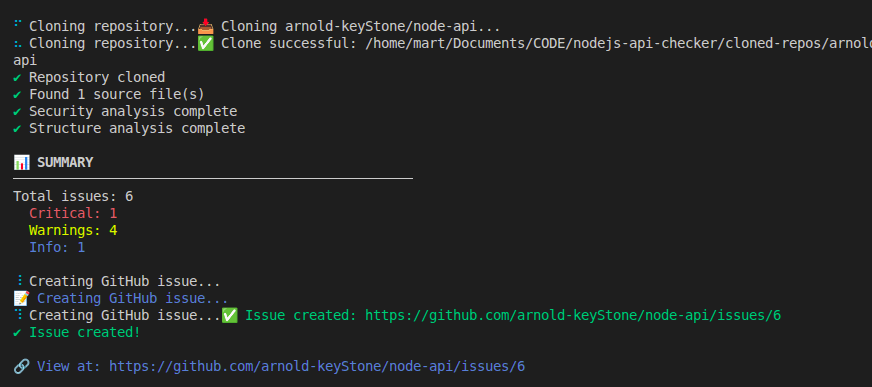
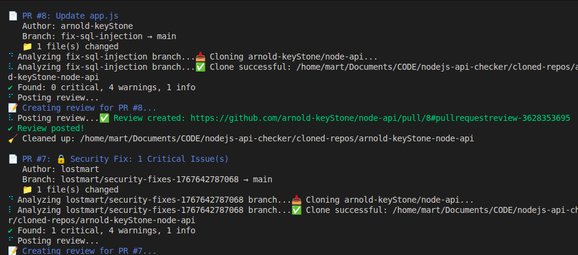

# 🤖 Node.js API Checker

A GitHub bot for automated code reviews of Node.js REST APIs. Designed for educators and code reviewers to provide consistent, detailed feedback on student and junior developer projects.

## 🎯 What Is This For?

### For Educators & Teachers

- **Automated code reviews** for student REST API projects
- **Consistent feedback** across multiple students
- **GitHub presence** - all reviews appear as your activity
- **Time-saving** - review 30+ projects quickly
- **Teaching tool** - shows students professional code review practices

### For Development Teams

- **Onboarding** - Help junior developers learn best practices
- **Quality gates** - Automated checks before code review
- **Security scanning** - Catch common vulnerabilities early
- **Standardization** - Enforce team conventions

### What It Detects

#### Security Issues (Critical)

- 🚨 SQL injection vulnerabilities
- 🚨 Hardcoded secrets (API keys, passwords)
- 🚨 Authentication bypass risks

#### Code Quality (Warnings)

- ⚠️ Missing folder structure (routes/, controllers/, models/)
- ⚠️ Monolithic files (all logic in one file)
- ⚠️ Missing separation of concerns
- ⚠️ Routes and database logic mixed together

#### Project Health (Info)

- 💡 Missing essential files (.gitignore, .env.example, README)
- 💡 Missing documentation

## ✨ Features

### 1. Issue Creation

Creates comprehensive GitHub issues with:

- Severity-based categorization (Critical, Warning, Info)
- Code snippets showing the problem
- Specific recommendations for fixes
- Line numbers for easy navigation

### 2. Pull Request Reviews

Automatically reviews open PRs with:

- Inline comments on specific problematic lines
- Overall review summary
- "Request Changes" for critical issues
- "Comment" for warnings and suggestions

### 3. Fix PR Generation

Creates pull requests with:

- Fixes for critical security issues
- TODO comments showing how to fix
- Educational explanations
- Ready-to-merge or learn-from code

### 4. Local Analysis

Analyze repositories without GitHub interaction:

- See results in terminal
- No GitHub API calls
- Perfect for testing

## 🚀 Quick Start

### Prerequisites

- Node.js 18+ installed
- Git installed
- GitHub account
- GitHub Personal Access Token

## Installation

```bash
npm install -g nodejs-api-checker
```

## Usage

1. **Clone the repository**

```bash
   git clone https://github.com/lostmart/NodeJs-api-checker
   cd nodejs-api-checker
```

2. **Install dependencies**

```bash
   npm install
```

3. **Create GitHub Personal Access Token**

   - Go to: https://github.com/settings/tokens
   - Click "Generate new token (classic)"
   - Name: "API Checker Bot"
   - Select scopes:
     - ✅ `repo` (full control of repositories)
     - ✅ `workflow` (optional)
   - Generate and copy the token

4. **Configure environment variables**

```bash
   cp .env.example .env
```

- Edit `.env` and add:

```bash
   GITHUB_TOKEN=ghp_your_token_here
   GITHUB_USERNAME=your_github_username
```

5. **Test authentication**

```bash
   npm start analyze https://github.com/octocat/Hello-World
```

### Basic Commands

```bash
# Analyze a repository (local only, no GitHub interaction)
npm start analyze

# Create a GitHub issue with findings
npm start issue

# Review all open pull requests
npm start review

# Create a fix PR for critical issues
npm start fix

# Show help
npm start -- --help
```

### Real-World Examples

#### Example 1: Review a Student's Project

```bash
# Student gives you collaborator access to their repo
npm start issue https://github.com/student-name/final-project-api

# Result: Creates Issue #1 with comprehensive review
```

#### Example 2: Review a Pull Request

```bash
# Student opens a PR with their fixes
npm start review https://github.com/student-name/final-project-api

# Result: Bot adds inline comments and overall review
```

#### Example 3: Create Fix PR

```bash
# Critical security issues found
npm start fix https://github.com/student-name/final-project-api

# Result: Bot creates PR with fixes student can learn from
```

#### Example 4: Batch Review Multiple Repos

```bash
# Create a script for multiple students
for repo in \
  "https://github.com/student1/api-project" \
  "https://github.com/student2/api-project" \
  "https://github.com/student3/api-project"
do
  npm start issue "$repo"
done
```

### Recommended Process

**Week 1: Initial Review**

```bash
npm start issue https://github.com/student/project
```

Students see comprehensive feedback in Issue #1

**Week 2: Students Fix Issues**
Students create PR with fixes → Request review

**Week 3: PR Review**

```bash
npm start review https://github.com/student/project
```

Bot reviews their fixes, approves or requests changes

**Week 4: Follow-up**
Students merge when approved, or create Fix PR if stuck:

```bash
npm start fix https://github.com/student/project
```

### Student Perspective

1. **Receives detailed issue** from teacher's bot
2. **Learns from specific examples** (code snippets + fixes)
3. **Creates PR with fixes**
4. **Gets immediate feedback** via automated review
5. **Learns GitHub workflow** (issues, PRs, reviews)

## 🔧 Advanced Usage

### Install Globally (Optional)

```bash
npm link
```

Then use from anywhere:

```bash
api-checker issue https://github.com/student/project
api-checker review https://github.com/student/project
api-checker fix https://github.com/student/project
```

### Uninstall Global

```bash
npm unlink -g nodejs-api-checker
```

## 📋 Requirements for Target Repositories

### For Full Functionality

Students must:

1. **Add you as collaborator** (Settings → Collaborators)
   - Need: Write access minimum
2. **Use Node.js + Express** for their API
3. **Have `.js` or `.ts` source files**

### What Happens Without Access

- ✅ **Analyze** command works (clones public repos)
- ❌ **Issue** command fails (can't create issues)
- ❌ **Review** command fails (can't review PRs)
- ❌ **Fix** command fails (can't create PRs)

## 🎯 Use Cases

### Educators

**University Courses**

- Review 30+ student projects per semester
- Consistent grading criteria
- Teach professional practices
- Save hours of manual review

**Bootcamps & Online Courses**

- Automated feedback on assignments
- Scale to hundreds of students
- Immediate feedback loop

### Development Teams

**Code Onboarding**

- New developer checklist enforcement
- Catch common mistakes early
- Reduce senior developer review time

**Quality Gates**

- Pre-review security checks
- Convention enforcement
- Technical debt detection

## 🛠️ How It Works

### Analysis Process

1. **Clone** the repository to `cloned-repos/` directory
2. **Parse** all `.js` and `.ts` files using Babel AST parser
3. **Analyze** with multiple analyzers:
   - Security Analyzer (SQL injection, secrets)
   - Structure Analyzer (folder organization)
4. **Generate** findings with severity levels
5. **Post** to GitHub (issue/review/PR) or display locally
6. **Cleanup** cloned repository

### Architecture

```
nodejs-api-checker/
├── src/
│   ├── analyzers/          # Code analysis logic
│   │   ├── security.js     # SQL injection, secrets detection
│   │   └── structure.js    # Folder architecture checks
│   ├── github/             # GitHub API integration
│   │   ├── client.js       # Authentication & API client
│   │   ├── issues.js       # Issue creation
│   │   ├── reviews.js      # PR review comments
│   │   └── pullRequests.js # Fix PR generation
│   ├── utils/              # Helper utilities
│   │   ├── parser.js       # AST parsing
│   │   └── git.js          # Repository cloning
│   └── index.js            # CLI entry point
├── cloned-repos/           # Temporary clones (auto-cleaned)
└── .env                    # Your configuration
```

## 🔒 Security & Privacy

### Data Handling

- ✅ Clones repositories **temporarily** (deleted after analysis)
- ✅ No data stored or transmitted to third parties
- ✅ Only accesses repositories you have permission for
- ✅ GitHub token stored locally in `.env` (never committed)

### Permissions Required

- **repo** scope: Read code, create issues, create PRs, add reviews
- The bot acts **as you** on GitHub

### Best Practices

- 🔒 Never commit your `.env` file
- 🔒 Use a dedicated token (not your personal token)
- 🔒 Revoke token when not in use
- 🔒 Review bot activity regularly

## 📊 Example Output

### Terminal Output (Analyze Command)

```
🤖 Node.js API Checker

📋 Analyzing: student-name/rest-api-project

✔ Repository cloned
✔ Found 3 source file(s)
✔ Security analysis complete
✔ Structure analysis complete

📊 SUMMARY
──────────────────────────────────────────────────
Total issues: 8
  Critical: 2
  Warnings: 5
  Info: 1

🚨 CRITICAL ISSUES
──────────────────────────────────────────────────

1. SQL Injection vulnerability detected
   Type: sql-injection
   File: app.js
   Line: 45
   Query uses string concatenation with user input
   Fix: Use parameterized queries with ? placeholders

2. Potential API Key found in code
   Type: exposed-secret
   File: config.js
   Line: 12
   Hardcoded secrets should never be committed
   Fix: Move secrets to environment variables
```

### GitHub Issue Created



### GitHub PR Review



## 🤝 Contributing

Contributions welcome! Areas for improvement:

- Additional analyzers (CORS, rate limiting, input validation)
- Support for more frameworks (Fastify, Koa, NestJS)
- Configuration file support (`.apirc.json`)
- Custom rule definitions

## 📝 License

MIT License - See LICENSE file for details

**Questions?** Open an issue or contact [@lostmart](https://github.com/lostmart)

**Star ⭐ this repo** if you find it useful for teaching or code review!
